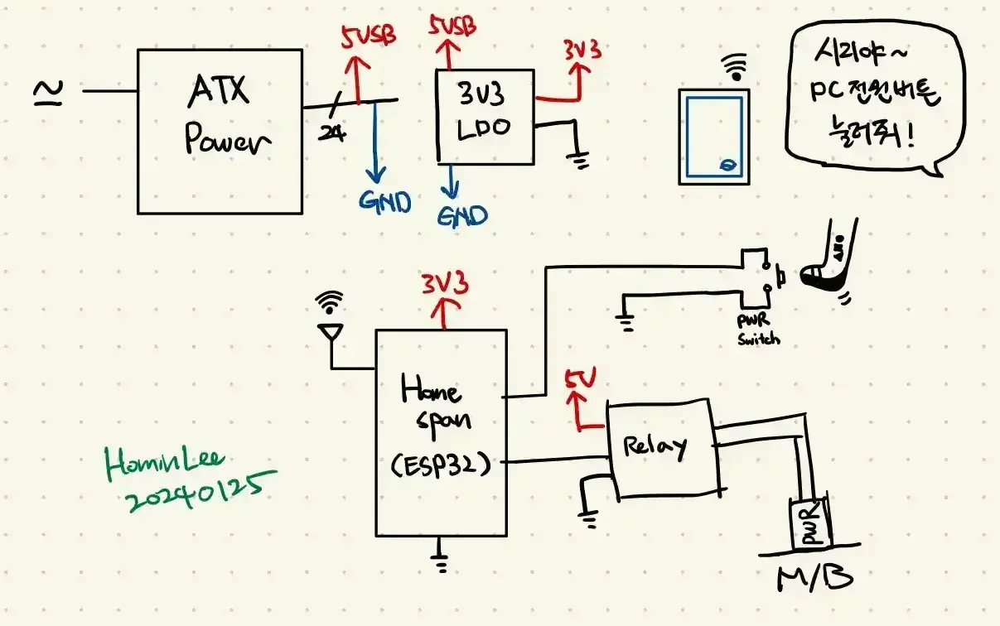

# hap-pc-btn



Rust firmware for **ESP32-S2** that exposes a **HomeKit Switch** accessory to pulse a PC power-button relay (500 ms). Behavior matches the original Arduino/HomeSpan reference in `_ref/arduino/`.

- **HomeKit**: [Espressif esp-homekit-sdk](https://github.com/espressif/esp-homekit-sdk) (C)
- **Rust**: `esp-idf-svc` + `esp-idf-hal` (std, FreeRTOS)
- **Pairing**: setup code `111-22-334`, setup ID `ES32`

## Features

- HomeKit Switch toggles a 500 ms relay pulse (then returns to Off)
- Physical button input with debounce triggers the same pulse
- Onboard status LED blinks while running
- Debug GPIO toggles with the relay

## Hardware

Target board: **ESP32-S2** (pin map matches `_ref/arduino/homekit_pc_switch.ino`)

| Signal       | GPIO | Notes                                      |
|--------------|------|--------------------------------------------|
| Status LED   | 15   | External LED (active high)                 |
| Power button | 18   | External input, pull-up, active low        |
| Relay out    | 12   | 500 ms pulse to PC front-panel header      |
| Debug out    | 16   | Toggles with relay                         |

**Avoid:** GPIO0, GPIO3, GPIO45, GPIO46 (strapping pins).

Pin constants live in `src/pins.rs`.

## Prerequisites

| Requirement   | Value                          |
|---------------|--------------------------------|
| Rust          | `esp-1.90` (`rust-toolchain.toml`) |
| Target        | `xtensa-esp32s2-espidf`        |
| MCU           | `esp32s2`                      |
| ESP-IDF       | **v5.5.3** (managed by embuild) |
| Flash tool    | `espflash`                     |

Install `espflash` if needed:

```bash
cargo install espflash
```

### Third-party SDK (git submodule)

esp-homekit-sdk is vendored as a **git submodule** at `third-party/esp-homekit-sdk`.

**Fresh clone** — initialize submodules after cloning this repo:

```bash
git clone <this-repo-url> hap-pc-btn
cd hap-pc-btn
git submodule update --init --recursive
```

**Existing checkout** — if `third-party/esp-homekit-sdk` is empty or missing:

```bash
git submodule update --init --recursive
```

**Troubleshooting** — if `git submodule add` fails with *already exists in the index* (stale gitlink without `.gitmodules`):

```bash
git rm --cached third-party/esp-homekit-sdk
git submodule add https://github.com/espressif/esp-homekit-sdk.git third-party/esp-homekit-sdk
git submodule update --init --recursive
```

Do **not** manually `git clone` into `third-party/esp-homekit-sdk`; that conflicts with the submodule entry. After updating the submodule, run `cargo build` as usual.

## Wi-Fi credentials

Edit `sdkconfig.defaults`, or set environment variables at build time (written to `sdkconfig.defaults.env` by `build.rs`):

```bash
export WIFI_SSID="your-ssid"
export WIFI_PASS="your-password"
```

`run.sh` is a local convenience wrapper that sets these and runs `cargo run --release`.

## Build and flash

**Important:** If your shell exports `IDF_PATH` pointing to ESP-IDF **6.x**, the build fails. esp-homekit-sdk requires IDF 5.x.

```bash
unset IDF_PATH
cargo build              # dev
cargo build --release
cargo run --release      # flash only (esp32s2, --no-stub)
```

The first build downloads ESP-IDF and tools (~5+ minutes). Later builds are much faster.

## HomeKit pairing

### Register the accessory

Use either method to add the switch in the iOS **Home** app:

1. **Serial monitor QR** — After flash/boot, the firmware prints an ASCII QR code and setup URI in the log (`app_hap_setup_payload`). Flash with `cargo run --release`, then open a serial monitor separately and scan the QR from the log output.

2. **Pre-generated QR image** — For the default `sdkconfig.defaults` settings below, scan this QR code:


| Setting    | Default value   |
|------------|-----------------|
| Setup code | `111-22-334`    |
| Setup ID   | `ES32`          |
| Setup URI  | `X-HM://0080QW42MES32` |

You can also enter the setup code manually in the Home app if QR scanning is inconvenient.

### Change setup code or Setup ID

Edit `sdkconfig.defaults` (`CONFIG_EXAMPLE_SETUP_CODE`, `CONFIG_EXAMPLE_SETUP_ID`), rebuild, and flash. Then regenerate a matching QR — the image above and any printed sticker will be wrong until you do.

```bash
./script/generate_qr.py              # print URI + settings summary
./script/generate_qr.py -s           # URI only
./script/show_homekit_pc_switch_qr.sh  # print URI and open QR in browser
```

`show_homekit_pc_switch_qr.sh` reads the current values from `sdkconfig.defaults` via `generate_qr.py`, so it stays in sync with firmware.

**Important:** Setup ID must match `CONFIG_EXAMPLE_SETUP_ID` in the flashed firmware. A QR with the wrong Setup ID can look valid in the Home app, but the ESP32 will not respond — mDNS discovery filters on the Setup ID suffix.

## How it works

```
HomeKit Switch On  →  C switch_write()  →  Rust relay_pulse()  →  500 ms HIGH  →  Switch Off
Physical button    →  Rust GPIO loop    →  same pulse + pc_homekit_physical_button()
```

WiFi and HAP run in a FreeRTOS task (`pc_homekit_start()`). Rust `main()` owns GPIO polling (button, LED, relay).

```
src/bin/main.rs              GPIO loop (button, LED, relay)
src/ffi.rs                   Rust ↔ C trampoline
components/pc_homekit/       HomeKit Switch + WiFi + HAP init
third-party/esp-homekit-sdk/ Espressif SDK (local clone)
```

## Configuration

| Change                    | Where                                              |
|---------------------------|----------------------------------------------------|
| Relay pulse duration      | `src/pins.rs` → `RELAY_PULSE_MS`                 |
| GPIO pins                 | `src/pins.rs`, `src/bin/main.rs`                   |
| HomeKit name / setup code | `components/pc_homekit/pc_homekit.c`, `sdkconfig.defaults` |
| WiFi mode                 | `sdkconfig.defaults`, esp-homekit-sdk `app_wifi`   |

## Project layout

| Path                  | Purpose                                      |
|-----------------------|----------------------------------------------|
| `Cargo.toml`          | Dependencies + esp-homekit-sdk component paths |
| `.cargo/config.toml`  | Target, runner, ESP-IDF version, MCU         |
| `sdkconfig.defaults`  | WiFi, HomeKit, stack/mDNS defaults           |
| `components/pc_homekit/` | Custom IDF component (HAP Switch)         |
| `script/`             | HomeKit QR code generators                   |
| `img/`                | Default HomeKit pairing QR image             |
| `AGENTS.md`           | Contributor / AI agent handoff notes         |

## References

- [esp-homekit-sdk](https://github.com/espressif/esp-homekit-sdk) — smart_outlet example
- [esp-idf Rust book](https://docs.esp-rs.org/esp-idf-template/)
- Arduino reference: `_ref/arduino/homekit_pc_switch.ino`

## License

Original code in this repository (Rust firmware, `components/pc_homekit/`, scripts, and documentation) is licensed under the [MIT License](LICENSE).

Third-party dependencies have their own licenses — notably [esp-homekit-sdk](https://github.com/espressif/esp-homekit-sdk) in `third-party/esp-homekit-sdk/`.
